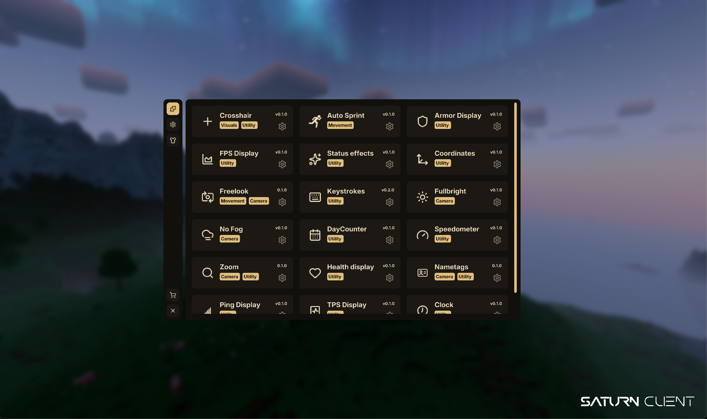

  

<h1 align="center">Saturn Client</h1>

  <b>A free and open-source Minecraft client.</b> 
  Built with performance, customization, and community in mind.

  

---

## ✨ About

Saturn Client is a free, open-source Minecraft client designed to enhance the gameplay experience while staying lightweight and customizable.
Our goal is to build a clean, optimized client that the community can contribute to and improve together.

This project is currently in **beta**, so features, visuals, and performance are continuously evolving.

---

## 🚀 Features

- Free cosmetics that don't require real money
- Clean and modern UI with animations
- Ongoing performance improvements
- Open-source and community-driven

---

## 🤝 Contributing

We welcome contributions of all kinds:

- Code improvements
- Bug fixes
- UI enhancements
- Cosmetic designs
- Suggestions and feedback

If you're an artist or designer interested in helping with cosmetics or visual assets, we’d love to collaborate.

---

## 🙌 Credits

- **Cloak Rendering:** `IIpho3nix`
- **Who Am I:** `FokshaWasTaken`
- **Panorama:**  
  https://www.planetminecraft.com/texture-pack/minecraft-cavesand-cliffs-part-ii-main-menu-panorama/

If any code or assets belong to you and you would like them removed, please open an issue.  
We aim to properly credit all contributors and respect original creators.

---

## 📜 License

Saturn Client is free and open-source using **Apache-2.0**

---

  Made with ❤️ by the Saturn Client team

